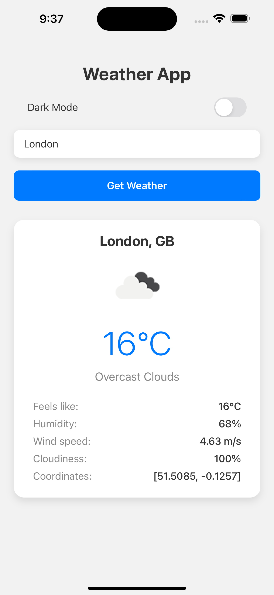
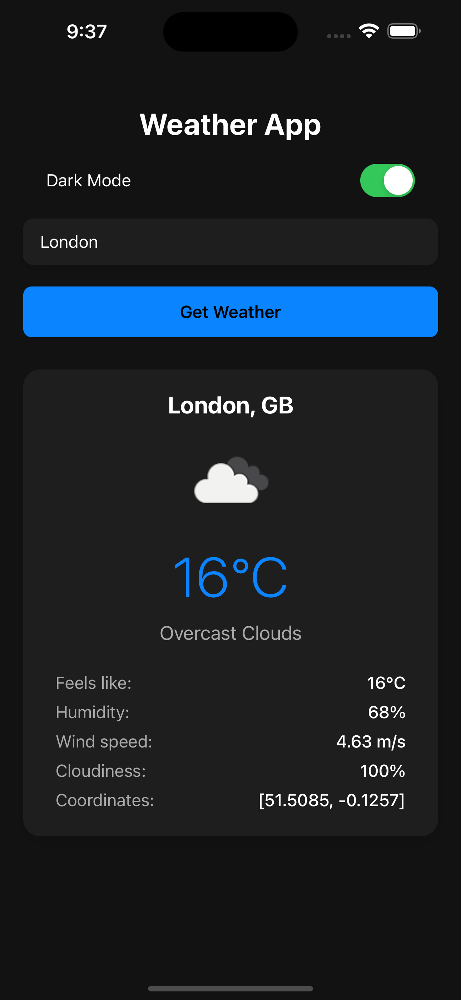
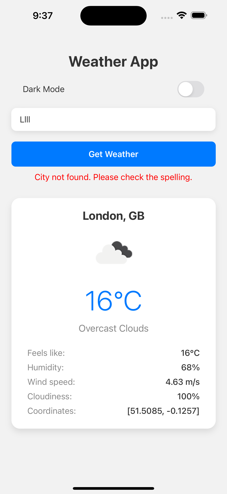
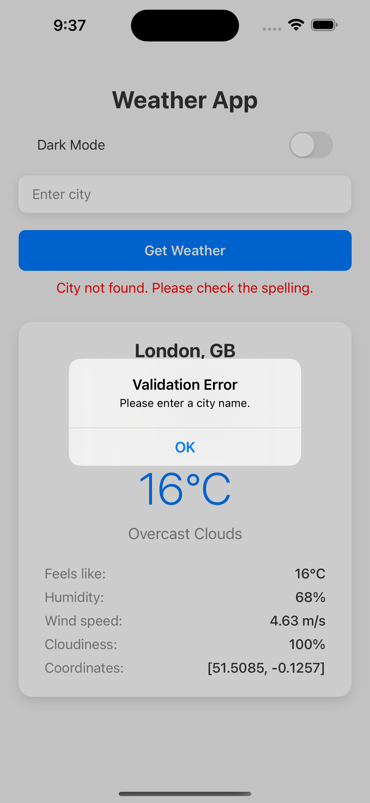

# 🌦️ WeatherApp

A simple cross-platform Weather App built with **React Native CLI**, developed as a technical task for a mobile developer position.

It uses the **OpenWeatherMap API** to fetch real-time weather data.

## 🖼️ Screenshots

<div align="center">
  
  
  
  
</div>

## 🚀 Features

- 🔍 Search weather by city name
- 🌡️ Display current temperature, condition, and icon
- ⚠️ Error message if the city is not found
- 💾 Persist last searched city using `redux-persist`
- 🌓 **Dark mode** support (implemented manually)
- 🧹 Clean and maintainable architecture

## 📦 Tech Stack

- React Native CLI
- TypeScript
- Redux Toolkit + Redux Persist
- OpenWeatherMap API
- Jest & React Native Testing Library (unit testing)

## 📁 Project Structure

<pre>
src/
├── api/         # API service (OpenWeatherMap integration)
├── components/  # Reusable UI elements
├── constants/   # Constants like default city, API URL base
├── hooks/       # Custom hooks
├── screen/      # App screens (e.g., Home)
├── store/       # Redux store, slices, persist config
├── theme/       # Theme & dark mode support
├── types/       # TypeScript type definitions
</pre>

## 📥 Installation

1. **Clone the repo**:

```bash
git clone https://github.com/igorkaktusjs/WeatherApp.git
cd WeatherApp
```

2. **Install dependencies**:

```bash
npm install
```

3. **iOS only** – Install pods:

```bash
cd ios && pod install && cd ..
```

4. **Add OpenWeatherMap API Key**:

Open the file `src/api/weather.ts` and replace the placeholder with a valid API key:

```ts
const API_KEY = 'your_api_key_here'; // Insert the key sent via email, or use your own verified key
```

You can obtain a free API key from: [https://openweathermap.org/api](https://openweathermap.org/api)

5. **Run the app**:

- Android:

```bash
npx react-native run-android
```

- iOS:

```bash
npx react-native run-ios
```

## ✅ Testing

Run unit tests with:

```bash
npm test
```

## 🧠 Architectural Decisions

- **State Management**: Redux Toolkit + redux-persist
- **Code Structure**: Separation by responsibility: screens, components, API, store, etc.
- **Dark Mode**: Implemented manually with state toggle and conditional styling
- **API Integration**: Abstracted in `api/weather.ts` for reusability

## 💡 Potential Improvements

> These ideas are not required by the task but could be beneficial for production scalability:

- 🎨 Use **NativeWind** or **Restyle** for scalable styling and easier dark mode support
- ⚡ Add animations with **Reanimated** to enhance UI/UX
- 🔄 Use **RTK Query**, **React Query**, or **GraphQL** for efficient API state management
- 🧪 Add end-to-end tests with **Detox**

## 📬 Contact

Feel free to reach out if you have any questions about the implementation!
